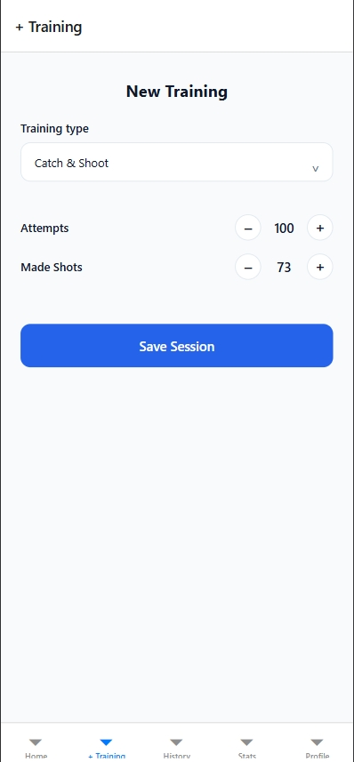

## Core UI Components (from Figma)

Based on the SmartShooter Figma design (`Mazuryk_cross_assignment_2`), the following reusable components were identified and implemented in React Native:

- `PrimaryButton` – main call-to-action button used on Home and New Training screens.
- `TrainingCard` – card for displaying past training sessions in the History grid.
- `StepperInput` – numeric input with +/- controls for Attempts and Made Shots.
- `StatsCard` – reusable container for charts (Accuracy Trend, Court Heatmap).
- `ProfileHeader` – user avatar with initials and basic player info.
- `ProgressBar` – horizontal level/XP indicator on the Profile screen.

## Responsiveness

- The History screen uses `useWindowDimensions` to calculate card width and keep a responsive two-column layout on different screen sizes.
- Layouts are built with Flexbox (`flexDirection`, `justifyContent`, `alignItems`) instead of fixed positions.
- The `ProgressBar` component uses flexible width (percentage-based) so it scales on various devices.

## Screenshots

