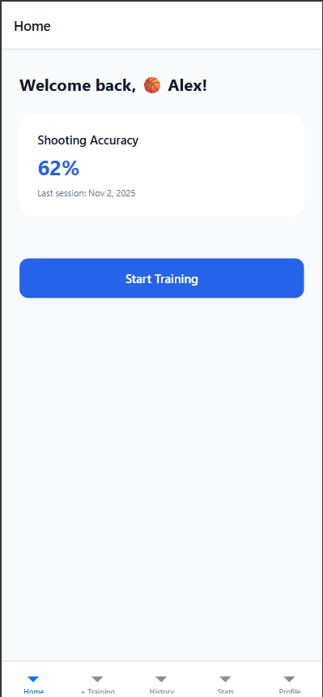
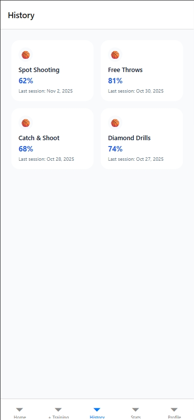
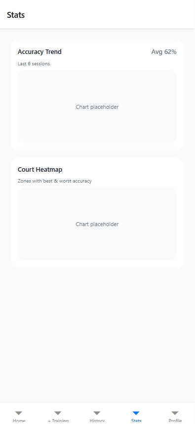
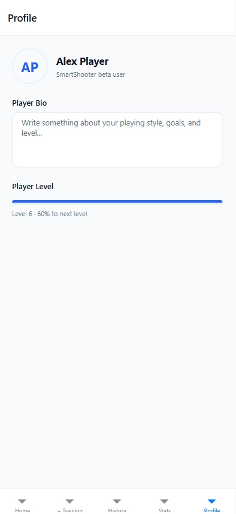

# SmartShooter RN – Navigation (Cross Assignment 4)

SmartShooter RN is a React Native (Expo + TypeScript) mobile app designed to track basketball shooting workouts.
This repository contains the implementation for **Cross Assignment 4**, covering navigation architecture, parameter passing, UI structure, and basic interactivity built according to the Figma design (`Mazuryk_cross_assignment_2`).

---

## 🧭 Navigation Architecture

The app uses **Expo Router** with a combination of **Stack** and **Tab** navigation:

```
app/
  _layout.tsx              # Root Stack (Tabs + Session Details)
  (tabs)/_layout.tsx       # Bottom Tab Navigator
  (tabs)/index.tsx         # Home
  (tabs)/new-training.tsx  # Create Training
  (tabs)/history.tsx       # History Grid
  (tabs)/stats.tsx         # Stats
  (tabs)/profile.tsx       # Profile
  session/[id].tsx         # Session Details
```

### **Root Stack:**
- Wraps the entire tab navigation.
- Provides a separate stack route for **Session Details (`session/[id]`)**.
- Custom header with back navigation.

### **Bottom Tabs:**
| Tab | Screen | Purpose |
|-----|--------|---------|
| 🏠 Home | index.tsx | Welcome + last session performance |
| ➕ Training | new-training.tsx | Create new training session |
| 🕒 History | history.tsx | Grid of training sessions |
| 📊 Stats | stats.tsx | Accuracy Chart + Heatmap |
| 👤 Profile | profile.tsx | User details & progress |

---

## 🔄 Data Passing Between Screens

When the user taps a card in **History**, the app navigates to `session/[id]` and passes parameters:

```ts
router.push({
  pathname: '/session/[id]',
  params: {
    id: item.id,
    type: item.type,
    accuracy: String(item.accuracy),
    lastSession: item.lastSession,
  },
});
```

On the receiving screen:

```ts
const { id, type, accuracy, lastSession } = useLocalSearchParams();
```

Fallbacks ensure the UI does not crash if a parameter is missing.

---

## 🧩 Core UI Components

Reusable components derived from the Figma prototype:

- **PrimaryButton**
- **StepperInput**
- **TrainingCard**
- **ProfileHeader**
- **StatsCard**
- **ProgressBar**

All stored under:

```
app/components/
```

Spacing, typography, and colors are centralized in:

```
app/constants/
```

---

## 📱 Responsiveness

Implemented using:

- **useWindowDimensions** for dynamic grid width (History)
- Flexbox (`justifyContent`, `alignItems`, `flexDirection`)
- Centralized spacing and color constants
- Vector icons that scale automatically

The layout works correctly on:

- Web (via Expo)
- Mobile devices (Expo Go)
- Different device widths simulated via DevTools

---

## 🎥 Demo Video

Navigation demonstration video is stored in:

`assets/videos/navigation.mp4`

Mentors can preview it directly from the repository.

---

## 🖼 Screenshots

(Replace these with actual final screenshots before LMS submission.)

### Home


### New Training


### History


### Session Details


### Stats


### Profile


---

## ▶️ How to Run

```bash
npm install
npx expo start
```

Then choose:

- **w** → Web browser
- **Scan QR** → Expo Go (Android/iOS)
- **a / i** → Android / iOS emulator (optional)

---

## 👤 Author

Roman Mazuryk  
React Native / Expo – SmartShooter RN Project  
Neoversity – React Native Module
